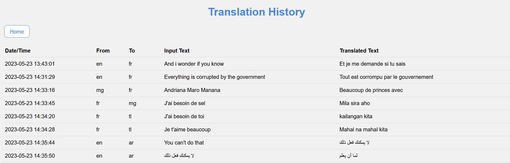

# Flask Web Application

This is a Flask web application that demonstrates a dropdown selection, input text, and AJAX functionality. It allows users to select languages from dropdown menus, input text, and submit the form to perform translations.

Please note that we couldn't use the Google API without a credit card, so we used the "Googletrans: Free and Unlimited Google translate API for Python" library instead.

The library can be found here:
https://py-googletrans.readthedocs.io/en/latest/

## Prerequisites

Make sure you have the following installed on your system:

- Python (version 3.6 or above)
- Flask (install via `pip install flask`)
- Googletrans (install via `pip install googletrans`)
- Pandas (install via `pip install pandas`)

## Getting Started

1. Clone the repository to your local machine .
2. Navigate to the project directory.

## Running the Application

1. Open a terminal or command prompt.
2. Run the following command to start the Flask development server:

   ```bash
   python app.py
   ```

3. The Flask development server will start running. You should see output similar to the following:

   ```
       * Running on all addresses (0.0.0.0)
       * Running on http://127.0.0.1:5000
       * Running on http://172.##.###.###:5000
      Press CTRL+C to quit
       * Restarting with stat
       * Debugger is active!
       * Debugger PIN: ########
   ```

4. Open a web browser and visit `http://localhost:5000` to access the application. Or using Ctrl+Click on the link above.

## Usage

The web application presents a form with the following components:

- **Select language (FROM):** Choose the source language from the dropdown menu.
- **Select language (TO):** Choose the target language from the dropdown menu.
- **Input Text:** Enter the text you want to translate.
- **Submit:** Click this button to perform the translation.
- **Output Text:** Displays the translated text.
- **Clear:** Click this button to clear the input and output text fields.

### Swap Buttons

- **Swap Dropdowns:** Clicking this button will swap the selected values between the "Select language (FROM)" and "Select language (TO)" dropdowns.
- **Swap Input Text:** Clicking this button will swap the text entered in the "Input Text" field with the text displayed in the "Output Text" field.

### History

- **History:** Clicking this button will display the history of translations performed in the current session. The history is displayed in a modal window.

## Screenshots

### Main Page


### History
